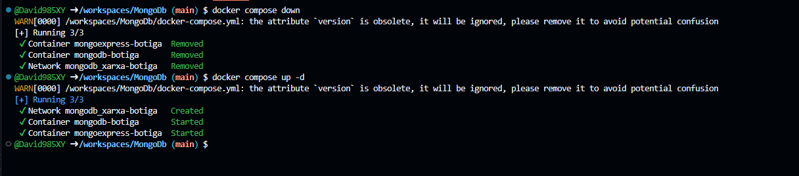

# Practica

BLOC 1:

1.2 Preguntes teòriques
Prepara la resposta d’aquestes preguntes i escriu-la al fitxer practica.md. Aquestes preguntes se’t
podran demanar en la validació oral.

1. Quina és la diferència entre docker run i docker compose up?

    docker run serveix per engegar un sol contenidor de forma puntual des de la línia 
    de comandes, especificant totes les opcions (ports, volums, variables d'entorn) manualment 
    cada vegada.

    docker compose up llegeix el fitxer docker-compose.yml i engega tots els serveis definits de cop, 
    amb la configuració ja guardada al fitxer. És molt més còmode quan tens múltiples serveis que han 
    de funcionar junts (com MongoDB + Mongo Express), i a més gestiona automàticament la xarxa entre ells.

2. Per a què serveix la instrucció depends_on? Garanteix que el servei dependent estigui
completament operatiu?

depends_on indica a Docker Compose l'ordre d'arrencada dels serveis. En el nostre cas, mongoexpress-botiga depèn de mongodb-botiga, de manera que Docker Compose engega primer el servei de MongoDB i després el de Mongo Express.

Però NO garanteix que MongoDB estigui completament operatiu quan Mongo Express intenta connectar-s'hi. depends_on només espera que el contenidor estigui engegat (l'estat "running"), no que el servei intern hagi acabat d'inicialitzar-se del tot. Per això hem afegit restart: unless-stopped a Mongo Express: si falla en connectar, es reinicia sol fins que MongoDB estigui llest.

Per garantir que el servei està realment operatiu caldria usar depends_on amb condition: service_healthy i definir un healthcheck.

3. Explica quina és la diferència entre una xarxa bridge per defecte i una xarxa
personalitzada (amb nom) a Docker Compose.

Xarxa bridge cal usar IPs per accedir, en canvi en una xarxa personalitzada els contenidors es troben pel nom del servei.

A més en la Xarxa Bridge tots els contenidors de Docker comparteixen la mateixa xarxa per defecte
En cambi en la xarxa personalitzada cada compose té la seva pròpia xarxa, 

En el nostre projecte hem creat xarxa-botiga, una xarxa personalitzada. Gràcies a això, Mongo Express pot referenciar MongoDB simplement amb el hostname mongodb-botiga, sense necessitat de saber la seva IP, que podria canviar en cada arrencada.

BLOC 2:

Prova de persistència:

1. Engega l'entorn: docker compose up -d
2. Accedeix a Mongo Express (http://localhost:8081) i verifica que existeix la BD botiga
3. Atura i elimina els contenidors: docker compose down
4. Torna a engegar: docker compose up -d
5. Verifica que les dades encara existeixen

Captura: 
Captura: [BotigaBD](image.png)

1. Què passaria si no definíssim cap volum?

Sense volums, les dades de MongoDB es guarden dins del contenidor. Quan fem docker compose down, el contenidor s'elimina i totes les dades es perden. En tornar a engegar l'entorn, la base de dades estaria buida i el script init.js s'executaria de nou, creant les dades des de zero.
Per comprovar-ho: si s'elimina el volum 
./data:/data/db del docker-compose.yml, en fer docker compose down i docker compose up -d 
les col·leccions tornen a tenir exactament els 10 documents inicials del script.

Captura: 
Captura: [BotigaBD](image.png)

2. Explica la diferència entre un volum named (amb nom) i un bind mount (ruta del host). Quan convé usar cada un?

un volum named es així mongo_data:/data/db el Docker gestiona on es guarda (/var/lib/docker/volumes/) el docker gestiona la portabilidad molt útil quan no tens que 
tocar les dades directament

El bind mount es així ./data:/data/db tu tries la ruta exacta del host útil per desenvolupar scripts d'inicialització, fitxers de configuració.

3. Explica la diferència entre l’estratègia embedding i l’estratègia referència amb exemples. Cal que els exemples siguin diferents dels que s’exposen en aquest document.

Embedding (dades incrustades dins el document principal):

Exemple: Un blog on cada post conté els seus comentaris incrustats. Com que els comentaris quasi sempre es mostren amb el post i rarament es consulten de forma independent, té sentit tenir-los al mateix document. Estalviem consultes addicionals a la base de dades.

json{
  "titol": "Com aprendre MongoDB",
  "autor": "Maria García",
  "comentaris": [
    { "usuari": "Jordi", "text": "Molt útil!", "data": "2024-05-01" },
    { "usuari": "Laura", "text": "Gràcies!", "data": "2024-05-02" }
  ]
}
Referència (semblant al model relacional, _id d'un altre document):

Exemple: Una matrícula universitària que referencia l'estudiant i l'assignatura per separat. Un estudiant pot tenir moltes matrícules al llarg dels anys, i les seves dades personals no s'han de repetir a cada matrícula. A més, les assignatures canvien de crèdits o professors i no volem actualitzar-ho a tots els documents.

json{
  "estudiant_id": ObjectId("..."),
  "assignatura_id": ObjectId("..."),
  "curs": "2024-2025",
  "nota_final": 8.5
}

4. Explica quina estratègia o estratègies has fet servir en la col·lecció comandes i per quin motiu.
He usat una estratègia mixta:

Referència per al client (client_id): el client té vida pròpia (dades personals, historial, etc.) i no té sentit duplicar tota la informació del client a cada comanda. Si el client canvia d'adreça o telèfon, no cal actualitzar totes les seves comandes.
Embedding per a les línies de comanda (linies): el preu dels productes pot canviar amb el temps. Si referències el producte per _id, en consultar una comanda antiga veuríem el preu actual i no el que va pagar el client. Incrustant la línia amb nom_producte i preu_unitari guardem un snapshot del moment de la compra, que és el comportament correcte en una botiga real.

Bloc 3

1. El nom del producte és únic?
No, tal com hem creat la col·lecció, el camp nom no és únic. MongoDB crea un índex únic automàticament sobre _id, però no sobre cap altre camp a menys que l'especifiquem explícitament. Podríem inserir dos productes amb el mateix nom sense cap error.
Per garantir la unicitat caldria crear un índex únic:
jsdb.productes.createIndex({ nom: 1 }, { unique: true })

2. Què significa "projectar" en les consultes?
Projectar és especificar quins camps volem que MongoDB retorni en el resultat d'una consulta, en lloc de retornar tot el document. És equivalent al SELECT camp1, camp2 FROM taula de SQL.
El segon argument de find() és la projecció:

1 → inclou el camp
0 → exclou el camp (per defecte tot el que no s'especifica s'inclou si posem algun 1)

Exemple diferent de l'enunciat: volem veure només el nom i la data de registre dels clients, sense veure l'adreça ni el telèfon:
jsdb.clients.find(
  { actiu: true },
  { nom: 1, cognoms: 1, data_registre: 1, _id: 0 }
)
Útil per reduir la quantitat de dades transferides quan no necessitem tots els camps.

3. Funcions i operadors utilitzats al CRUD
Funció / OperadorSignificatExemple diferent de l'enunciatinsertOne(doc)Insereix un sol documentdb.clients.insertOne({ nom: "Pau", email: "pau@email.com" })insertMany([])Insereix múltiples documents d'un copdb.clients.insertMany([{nom:"A"}, {nom:"B"}])find(filtre, proj)Cerca documents que compleixen el filtredb.clients.find({ actiu: false }, { nom: 1 })$ltLess than – menor quedb.comandes.find({ total: { $lt: 50 } })$gtGreater than – major quedb.comandes.find({ total: { $gt: 100 } })$gteGreater or equal – major o igualdb.clients.find({ data_registre: { $gte: new Date("2024-01-01") } })updateOne(f, upd)Actualitza el primer document que compleix el filtredb.clients.updateOne({ email: "pau@email.com" }, { $set: { actiu: false } })updateMany(f, upd)Actualitza tots els documents que compleixen el filtredb.clients.updateMany({ actiu: false }, { $set: { eliminat: true } })$setEstableix el valor d'un campdb.comandes.updateOne({ _id: id }, { $set: { estat: "entregada" } })$incIncrementa un camp numèricdb.productes.updateOne({ nom: "Raqueta" }, { $inc: { estoc: -1 } })$pushAfegeix un element a un arraydb.clients.updateOne({ nom: "Maria" }, { $push: { historial: "login" } })deleteOne(f)Elimina el primer document que compleix el filtredb.clients.deleteOne({ email: "spam@email.com" })deleteMany(f)Elimina tots els documents que compleixen el filtre